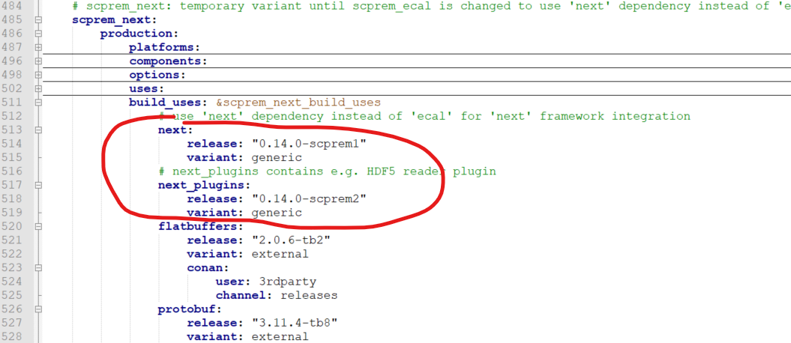
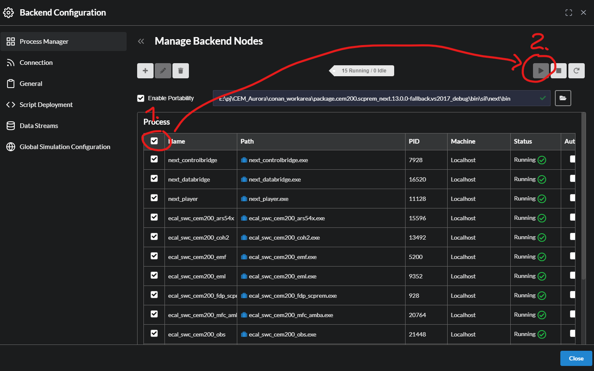

Aurora CEM200 test case {#manual_test_aurora_cem200}
=====

[TOC]

---

# Overview {#manual_test_aurora_cem200_overview}

The main functionalities tested here: <B>triggering</B>, <B>timestamp service</B>.

---

# References {#manual_test_aurora_cem200_references}

* [Manual Integration Test Cases Main Page ](@ref manual_test_main)
* [SCP test case](@ref manual_test_scp)
* https://confluence.auto.continental.cloud/display/SIMEN/NEXT+SIL+environment+for+CEM+scprem

---

## Prerequisites
Make sure you have installed all the <B>prerequisites</B>:
 - Next Client (GUI)
 - Next repository cloned and built (release is recommended)
 - next_plugins repository cloned and built (release is recommended)

---

## Prepare the CEM200 environment
To test that Next is working in the projects we need to integrate it and let the project components run.
To do so follow the steps explained here:

<B>1.</B> <B>Clone CEM200</B> from: https://github-am.geo.conti.de/ADAS/CEM200  

<B>2.</B> Checkout the branch: <B>master</B>  

<B>3.</B> Replace the <B>next package version</B> and the <B>next_plugins package version</B> in the <B>build_uses</B> section of <B>/conf/build.yml</B> with your <B>local next release</B> or with the version you want to test (ex. 0.14.0-rc4):  
 

<B>4.</B> Open command window in the <B>si_core folder</B> and run: <B>py .\scripts\cip.py sync</B> command, after that <B>build</B> the with: `py .\scripts\cip.py build --platform vs2017_debug --variant scprem_next` 

---

# Steps {#manual_test_aurora_cem200_steps}
Steps to perform Aurora CEM200 test on Microsoft Windows.

##1. Copy test case to your local drive
Go to <B>\\\\cw01.contiwan.com\Root\Loc\ulm2\didt6448\Recordings\sim_team_share\Next Feature Integration Test\TestCases\reworked_tests\ </B>and copy <B>Aurora_CEM</B> folder to your local drive (ex. C:\TestCases\Aurora_CEM).

##2. Start Next Client (GUI)
Start <B>Next Client (GUI)</B> and select <B>"start new session"</B> for <B>both backend and widgets</B>. 

##3. Copy nodes to correct folder
\conan_workarea\package.cem200.scprem_next.13.0.0-fallback.vs2017_debug\bin\sil\next\copySCPREMNodes.bat

##4. Load backend configuration
In the GUI go to <B>File -> Import -> Backend Configuration</B> and select <B>"next_backend_conf.json"</B> from your disk.
(\conan_workarea\package.cem200.scprem_next.13.0.0-fallback.vs2017_debug\bin\sil\next\bin\)
 

##5. Load widget configuration
TODO: Add widget config once we have a running setup. 

##6. Start-up the nodes
From Process Manager <B>select all executables (1)</B> and <B>start processes (2)</B> :

 

##7. Load recording
In the GUI go to <B>File -> Load Recording</B> and select <B>FR-PLC-LYNX01.hdf5</B> from the <B>"\Aurora_CEM\recording\20240411\ADT400_2024_04_11-10_27_20_a23c371_LI-DC-632_SRR_TIMESYNC\FR-PLC-LYNX01\"</B> folder on your disk. 

##8. Open eCal Monitor
Open eCal monitor (for later checks of triggering later).

##9. Play the recording 3 seconds
Click on <B>play recording</B> button. Stop after ~3 seconds.

##10. Check component triggering
Check the status in the ecal monitor if component triggering is happening.
Number of trigger events in cem200_emf subcomponent has to increase.
Number of trigger events in cem200_tpo subcomponent has to increase.
TODO: Add screenshot once we have a running setup.

##11. Check timestamp service
CEM200 subcomponent triggering is only happening if the timestamp service is working correct.
Check the output of some CEM200 subcomponent if a timestamp (<> zero) is visible in the table view.
e.g. signal "SIM VFB.CEM200_TPO.m_tpObjectList.sigHeader.uiTimeStamp"
TODO: Add screenshot once we have a running setup.

---
